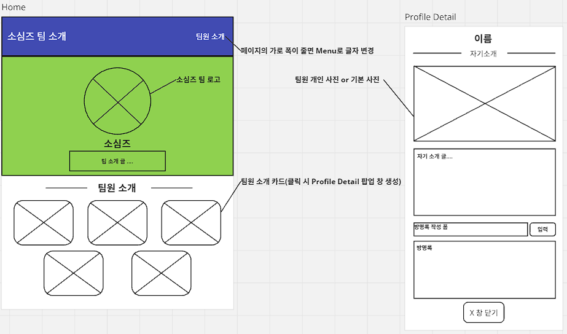

# 1주차 미니 프로젝트 S.A

-   **팀**
    -   팀 명 : 소심즈
    -   팀 소개 : 소심한 사람들의 모임
    -   팀원 : 장용환, 권준석, 김도현, 심윤호, 정인호
-   **프로젝트**

    -   프로젝트 명 : 자기소개 웹 페이지 만들기
    -   프로젝트 소개 : 팀과 팀원의 자기소개를 담은 웹 페이지 제작
    -   목표
        -   웹 개발 전반의 흐름 이해
        -   BootStrap 템플릿 활용
        -   AJAX에 대한 이해와 활용

-   개발 일정

    2024.08.26. ~ 2024.08.30.

    [캘린더 보기](./assets/doc_img/wire_frame.PNG)

-   **역할 분담**

    |  이름  |                                      역할                                      |
    | :----: | :----------------------------------------------------------------------------: |
    | 장용환 | BootStrap 템플릿 탐색 및 수정, 댓글 추가.수정.삭제 기능 구현, 개인 페이지 구현 |
    | 권준석 | BootStrap 템플릿 탐색 및 수정, 댓글 추가.수정.삭제 기능 구현, 개인 페이지 구현 |
    | 심윤호 | BootStrap 템플릿 탐색 및 수정, 댓글 추가.수정.삭제 기능 구현, 개인 페이지 구현 |
    | 김도현 | BootStrap 템플릿 탐색 및 수정, 댓글 추가.수정.삭제 기능 구현, 개인 페이지 구현 |

-   **사용하는 기술**

    -   HTML
    -   JavaScript
    -   CSS
    -   GitHub
    -   AJAX
    -   JQuery
    -   BootStrap

-   **와이어 프레임 웹 페이지에 적용될 내용**

    

    -   **상호작용 가능한 요소**
        -   Home
            -   팀원 소개 카드
        -   Profile Detail
            -   방명록 작성 폼
            -   입력 버튼
            -   창 닫기 버튼

-   **프로젝트에 적용될 내용**

    -   자기소개
    
        | 이름| 장용환 | 심윤호 | 권준석 | 김도현 |
        |:---|---|---|---|---|
        | 생년월일 | 2000.04.28. | 1998.02.11 | 1994.04.24 | 2005.08.20 |
        | 취미 | 게임, 술, 코딩 | 게임 | 게임, 음식 | 그림, 음악, 게임 |
        | 블로그 주소 | https://coreeny.tistory.com/ | https://velog.io/@syh213/posts | https://velog.io/@jun_seok/posts | https://11ioo.tistory.com/ |
        |  개발을 시작한 계기  &nbsp;&nbsp;&nbsp;&nbsp;&nbsp;&nbsp;&nbsp;&nbsp;&nbsp;&nbsp;&nbsp;&nbsp;&nbsp;&nbsp;&nbsp;&nbsp;&nbsp;&nbsp;&nbsp;&nbsp;&nbsp;&nbsp; | 어렸을 때 본 드라마에 개발자가 너무 멋있어서 시작하게 되었습니다. | 학교에서 코딩을 하다가 재미를 느껴 시작하게 되었습니다. | 게임은 어떻게 만드나 생각하다 개발에 관심이 생겨 시작하게 되었습니다 | 어렸을때부터 게임을 만들고 싶다는 생각이 있어 이것저것 찾아보다가 개발을 시작하게 되었다. |
        | 한마디 | 내일 배움 캠프를 통해 좋은 개발자로 성장하고 싶습니다! | 이번 캠프를 진행하면서 같이 일하고 싶은 사람이 되고 싶습니다 | 캠프를 통해 깊이를 채워가는 좋은 개발자가 되고싶습니다 | 더이상 기초만 하는 사람이 아니라 심화까지 가능한 개발자가 되자 |
        | 협업 스타일 | 다른 사람의 의견을 잘 수용하고, 계획을 세워 체계적으로 프로젝트를 진행하려 노력합니다. | 모르거나 어려운 문제를 서로 같이 풀고 배우면서 같이 성장하려 노력합니다. | 엉둥할지도 모르지만 폭 넓은 브레인 스토밍을 제공하겠습니다 | 팀이 이상한 방향으로 가는것 같으면 옆에서 잡아 주겠습니다. |

    -   팀소개
        |팀설명|소심한 사람들이 모인 팀입니다.|
        |--|--|
        |우리 팀의 약속|1. 매일 일정 소화하기 2. 부끄러워도 물어보기 3. 이번 프로젝트 포트폴리오로 사용하기 4. 1일 1TIL, 1 알고리즘 5. 당일 푼 코드카타 리뷰하기|
        |팀의 특징|소심해도 서로 해야 할 일은 미루지 않고 먼저 하려고 합니다.|
        |궁극적인 목표|좋은 개발자가 되어서 좋은 회사에 취업하는 것이 목표입니다.|

-   **개발 및 결합 방법**
    -   개발 방법
        -   BootStrap의 템플릿 사용
        -   개인이 만들어야 할 부분을 모듈화 시켜 구현
    -   결합 방법
        -   각 모듈의 개발이 완료될 때마다 결합
